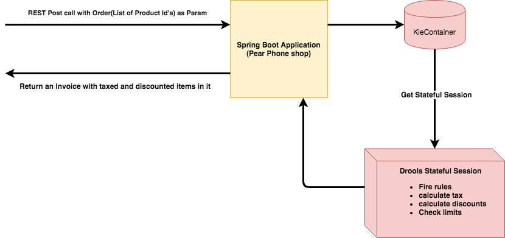
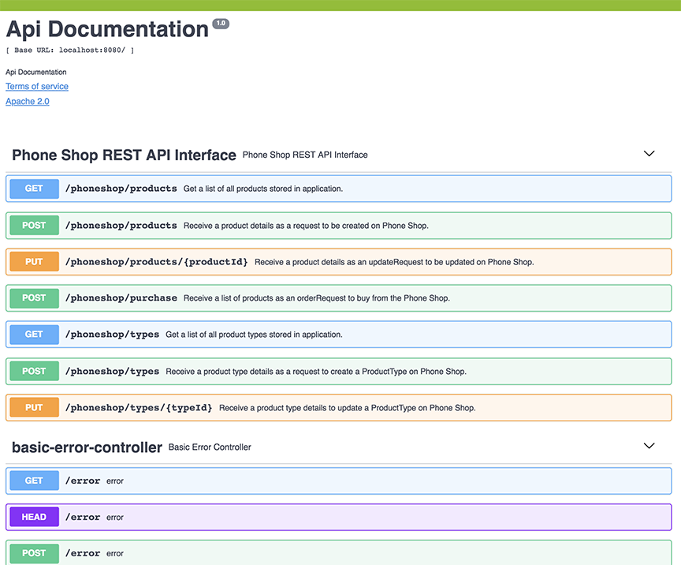

# phone-shop

## Project Structure
This is a SpringBoot application. PhoneShop project is based on using Java 8 SDK and it used Maven for build artifact,dependency management.
As the fact it is a Maven project you could easily imported to any Java based IDE.
I have used IntelliJ Idea as it is  my favourite IDE.

### DB configuration
I have used an H2 database to keep the records.
- There is a script file that run at start-up and create some pre-defined record for created entities.
  - Script path:~/phone-shop/src/main/resources/sql/PhoneShopDBScript.sql
  - The script file set it in application.properties to be run at starting of spring boot application
- There are two entities(Tables):
  - Product
  - ProductType 
       
 ##### List of predefined ProductType:
 
 | ID   |  Name             |   Desc          |
 | --- | -------------      |---------        |
 |  1   |   Phone	       | Phone           |
 |  2   |   Phone Insurance | Phone Insurance |
 |  3   |   Phone Cas       | Phone Case      |
 |  4   |   SIM Card	       | SIM Card        |
 
 #### List of pre-created products:
 
 |ID    |   Name        |    Desc                        | Quantity  |  Price| ProductTypeId | Product Type Name(*)  |
 | ---  | :---------     |  :--------------------------    | ------    | ---   |:------------:   |:------------           |
 |  1   |Pear myPhoneX  |   Pear myPhoneX                |   200     |    500|       1       |Phone                  |
 |  2   |Pear myPhone7  |   Pear myPhone7                |   200     |    300|       1       |Phone                  |
 |  3   |SIM Card       |   SIM Card                     |   200     |     20|       4       |SIM Card               |
 |  4   |Phone Insurance|   Phone Insurance (for 2 years)|   200     |    120|       2       |Phone Insurance        |
 |  5   |Phone Case     |   Phone Case                   |   200     |     10|       3       |Phone Case             |


 *Product Type Name  column added here just for sake of clarity it is not part  Product Entity.
 
### Rule Engine
   I have used [Drools](https://docs.jboss.org/drools/release/7.7.0.Final/drools-docs/html_single/index.html) for build and manage phone-shop rules.
   [Drools](https://www.drools.org/) rules engine, allowing fast and reliable evaluation of business rules and complex event processing.
   A rule engine is also a fundamental building block to create an expert system which, in artificial intelligence, is a computer system that emulates the decision-making ability of a human expert.
   
   ##### List of Pear Phone Shop Rules:
- One SIM Card is added for free for each myPhone sold;
- SIM cards sold on their own (not with the phone) are “Buy One Get One Free”;
- Insurance is discounted 25% if you buy any type of phone;
- There is a “4 for 3” offer on Phone Cases
- The law prevents anyone buying more than 10 SIM cards in a single purchase
- A 14% VAT is added to all purchases, BUT insurance productEntities are exempt;
#### Business Rules File
- PearPhoneShop.drl file contains implementation of above rules and located at :~/phone-shop/src/main/resources/com.gnaderi.interview.phoneshop.rules/PearPhoneShop.drl
- An additional metadata file META-INF/kmodule.xml. 
  - The kmodule.xml file is the descriptor that selects resources to knowledge bases and configures those knowledge bases and sessions. There is also alternative XML support via Spring and OSGi BluePrints.    
     
     
     
    
## Tools
Only tools and API was used to build this project is:
- Java 8 SDK
- Spring boot
- Maven
- Drools
- H2 in memory database
- Swagger for API Documentations

## Running Project
As it is a normal spring boot application you will be able run it as follow:
- Open terminal and go to project folder:`~/phone-shop`
- Build the project : `mvn clean compile install  -DskipTests`
- Run it : `java -jar target/phone-shop-0.0.1-SNAPSHOT.jar` 
- Phone-shop application will run on default port: `8080`

- URL: `http://localhost:8080/phoneshop`


## TEST(Play with) Pear Phone Shop
The best way to test or play around the application is by installing [Postman](https://www.getpostman.com/).
I have gave two method of call one is using Curl call from Linux terminal or using Postman call.

## Get list of products stored in PhoneShop
cURL call:
```
curl -X GET http://localhost:8080/phoneshop/products 
```

Postman:
- URL: GET http://localhost:8080/phoneshop/products

- Body:`null`

It will fetch all products that created on startup by DB Script(`resources/sql/PhoneShopDBScript.sql`)

```
{
    "productCatalog": [
        {
            "id": 1,
            "productName": "Pear myPhoneX",
            "desc": "Pear myPhoneX",
            "category": "Phone",
            "price": 500,
            "quantity": 200
        },
        {
            "id": 2,
            "productName": "Pear myPhone7",
            "desc": "Pear myPhone7",
            "category": "Phone",
            "price": 300,
            "quantity": 200
        },
        {
            "id": 3,
            "productName": "SIM Card ",
            "desc": "SIM Card",
            "category": "SIM Card",
            "price": 20,
            "quantity": 200
        },
        {
            "id": 4,
            "productName": "Phone Insurance",
            "desc": "Phone Insurance (for 2 years)",
            "category": "Phone Insurance",
            "price": 120,
            "quantity": 200
        },
        {
            "id": 5,
            "productName": "Phone Case",
            "desc": "Phone Case",
            "category": "Phone Case",
            "price": 10,
            "quantity": 200
        }
    ]
}
```

## Create a product
cURL call:
```curl -X POST \
  http://localhost:8080/phoneshop/products \
  -H 'Cache-Control: no-cache' \
  -H 'Content-Type: application/json' \
  -H 'Postman-Token: 941095b1-9eb9-4c2f-990a-fe8ecc6cfebd' \
  -d '{
   "productName": "Pear Samsung Galaxy S9",
   "desc": "Latest Samsung Galaxy S9 2018",
   "category": "Phone",
   "price": 700,
   "quantity": 150
}'

```

Postman:
- URL: POST http://localhost:8080/phoneshop/products

- Body:
 
```
{
   "productName": "Pear Samsung Galaxy S9",
   "desc": "Latest Samsung Galaxy S9 2018",
   "category": "Phone",
   "price": 700,
   "quantity": 150
}
```


The response will be something like below:

```
{
    "id": 6,
    "name": "Pear Samsung Galaxy S9",
    "desc": "Latest Samsung Galaxy S9 2018",
    "quantity": 150,
    "price": 700,
    "productType": {
        "id": 1,
        "name": "Phone",
        "desc": "Phone"
    }
}
```


## Update a product    
cURL call:
```
curl -X PUT \
  http://localhost:8080/phoneshop/products/6 \
  -H 'Cache-Control: no-cache' \
  -H 'Content-Type: application/json' \
  -H 'Postman-Token: 4bedb1a7-2451-491e-8504-c5554226f166' \
  -d '{
   "productName": "Samsung Galaxy S9",
   "desc": "Latest Samsung Galaxy S9 2017",
   "category": "Phone",
   "price": 600,
   "quantity": 100
}'
```

Postman:
- URL: PUT http://localhost:8080/phoneshop/products/6

- Body:
 
```
{
   "productName": "Samsung Galaxy S9",
   "desc": "Latest Samsung Galaxy S9 2017",
   "category": "Phone",
   "price": 600,
   "quantity": 100
}
```


The response will be something like below:

```
{
    "id": 6,
    "name": "Samsung Galaxy S9",
    "desc": "Latest Samsung Galaxy S9 2017",
    "quantity": 100,
    "price": 600,
    "productType": {
        "id": 1,
        "name": "Phone",
        "desc": "Phone"
    }
}
```


## Create purchase order

cURL call:
```
curl -X POST \
  http://localhost:8080/phoneshop/purchase \
  -H 'Cache-Control: no-cache' \
  -H 'Content-Type: application/json' \
  -H 'Postman-Token: f69f3420-1d64-4881-bddc-3f2fd39bdbb8' \
  -d '{
   "items": [5,1,2,2,3,3,3,1,5,5,5,5,5,5,5,3,2,1,5]
}'
```

Postman:
- URL: POST http://localhost:8080/phoneshop/purchase

- Body:
 
```
{
   "items": [5,1,2,2,3,3,3,1,5,5,5,5,5,5,5,3,2,1,5]
}
```


The response will be something like below:

```
{
    "InvoiceNumber": 1,
    "date": "2018-05-23",
    "dueDate": "2018-06-06",
    "amount": 2470,
    "tax": 345.8,
    "total": 2815.8,
    "items": [
        {
            "rowNumber": 0,
            "product": "Phone Case",
            "desc": "Phone Case",
            "category": "Phone Case",
            "amount": 0,
            "tax": 0,
            "total": 0
        },
        {
            "rowNumber": 1,
            "product": "Pear myPhoneX",
            "desc": "Pear myPhoneX",
            "category": "Phone",
            "amount": 500,
            "tax": 70,
            "total": 570
        },
        {
            "rowNumber": 2,
            "product": "Pear myPhone7",
            "desc": "Pear myPhone7",
            "category": "Phone",
            "amount": 300,
            "tax": 42,
            "total": 342
        },
        {
            "rowNumber": 3,
            "product": "Pear myPhone7",
            "desc": "Pear myPhone7",
            "category": "Phone",
            "amount": 300,
            "tax": 42,
            "total": 342
        },
        {
            "rowNumber": 4,
            "product": "SIM Card ",
            "desc": "SIM Card",
            "category": "SIM Card",
            "amount": 0,
            "tax": 0,
            "total": 0
        },
        {
            "rowNumber": 5,
            "product": "SIM Card ",
            "desc": "SIM Card",
            "category": "SIM Card",
            "amount": 0,
            "tax": 0,
            "total": 0
        },
        {
            "rowNumber": 6,
            "product": "SIM Card ",
            "desc": "SIM Card",
            "category": "SIM Card",
            "amount": 0,
            "tax": 0,
            "total": 0
        },
        {
            "rowNumber": 7,
            "product": "Pear myPhoneX",
            "desc": "Pear myPhoneX",
            "category": "Phone",
            "amount": 500,
            "tax": 70,
            "total": 570
        },
        {
            "rowNumber": 8,
            "product": "Phone Case",
            "desc": "Phone Case",
            "category": "Phone Case",
            "amount": 0,
            "tax": 0,
            "total": 0
        },
        {
            "rowNumber": 9,
            "product": "Phone Case",
            "desc": "Phone Case",
            "category": "Phone Case",
            "amount": 10,
            "tax": 1.4,
            "total": 11.4
        },
        {
            "rowNumber": 10,
            "product": "Phone Case",
            "desc": "Phone Case",
            "category": "Phone Case",
            "amount": 10,
            "tax": 1.4,
            "total": 11.4
        },
        {
            "rowNumber": 11,
            "product": "Phone Case",
            "desc": "Phone Case",
            "category": "Phone Case",
            "amount": 10,
            "tax": 1.4,
            "total": 11.4
        },
        {
            "rowNumber": 12,
            "product": "Phone Case",
            "desc": "Phone Case",
            "category": "Phone Case",
            "amount": 10,
            "tax": 1.4,
            "total": 11.4
        },
        {
            "rowNumber": 13,
            "product": "Phone Case",
            "desc": "Phone Case",
            "category": "Phone Case",
            "amount": 10,
            "tax": 1.4,
            "total": 11.4
        },
        {
            "rowNumber": 14,
            "product": "Phone Case",
            "desc": "Phone Case",
            "category": "Phone Case",
            "amount": 10,
            "tax": 1.4,
            "total": 11.4
        },
        {
            "rowNumber": 15,
            "product": "SIM Card ",
            "desc": "SIM Card",
            "category": "SIM Card",
            "amount": 0,
            "tax": 0,
            "total": 0
        },
        {
            "rowNumber": 16,
            "product": "Pear myPhone7",
            "desc": "Pear myPhone7",
            "category": "Phone",
            "amount": 300,
            "tax": 42,
            "total": 342
        },
        {
            "rowNumber": 17,
            "product": "Pear myPhoneX",
            "desc": "Pear myPhoneX",
            "category": "Phone",
            "amount": 500,
            "tax": 70,
            "total": 570
        },
        {
            "rowNumber": 18,
            "product": "Phone Case",
            "desc": "Phone Case",
            "category": "Phone Case",
            "amount": 10,
            "tax": 1.4,
            "total": 11.4
        }
    ]
}
```

## Product Type API
Similar to Product just follow same as above and will be able to create a ProductType, get all of them or update them.


## UT Vs Integration tests, which one are you going to use? Why?
UT Vs Integration tests is an important topic.I feel like this is pretty straight forward, but is still worth of clarifying.
In my developer life I have coded a lot of Unit & Integration tests and following are some of my thoughts on testing.
My definition of each breaks down as follows:

- Unit Tests:
  - Focused on defining (not testing) the behavior of a particular class, and that class only.
  - Fast (fast in running them and writing them!)
  - No external implementation dependencies (filesystem, database, web services, etc.).  All dependencies are mocked for the test context.
  - Can easily be paralleled, since each test is atomic
  
- Integration Tests:
  - Focused on verifying the integration of one or more components together.
  - May have external dependencies. (in fact, it is likely testing the integration with this dependency)
  - A test that takes longer than a unit Test should (longer than 0.1 seconds per test)
  - Both unit and integration are focused on the internal quality of the application, whereas acceptance tests focus on the external, or business quality of the application.

## API definitions by Using YAML
I have used [Swagger](https://swagger.io/) for build documents for REST API Services.
There are two files:
- REST-API-DOC-swagger.json: It's the Json version of the REST API Doc and you could used it in[http://editor.swagger.io/](http://editor.swagger.io/) to visualize the Phone shop API.
- REST-API-DOC-swagger.yaml: It's YAML file that converted from Json to be used if you prefer YAML.

[Swagger](https://en.wikipedia.org/wiki/Swagger_(software)) is an open source software framework backed by a large ecosystem of tools 
that helps developers design, build, document, and consume RESTful Web services.
Swagger is the world’s largest framework of API developer tools for the OpenAPI Specification(OAS), enabling development across the entire API lifecycle, from design and documentation, to test and deployment.

Swagger API Documentation:

   
   
   
   
   
   
   
   
### Bug Warning: Drools does not work with spring-boot-devtools
I have faced following bug and cost me a some good hours.

Drools does work with spring-boot-devtools.
If you add in pom.xml the following, no rules will be fired in Drools.
```
     <dependency>
            <groupId>org.springframework.boot</groupId>
            <artifactId>spring-boot-devtools</artifactId>
            <scope>runtime</scope>
      </dependency>
```
if you comment out this, then rules will be fired in Drools.

Link to the Bug [DROOLS-1540](https://issues.jboss.org/browse/DROOLS-1540)
   .